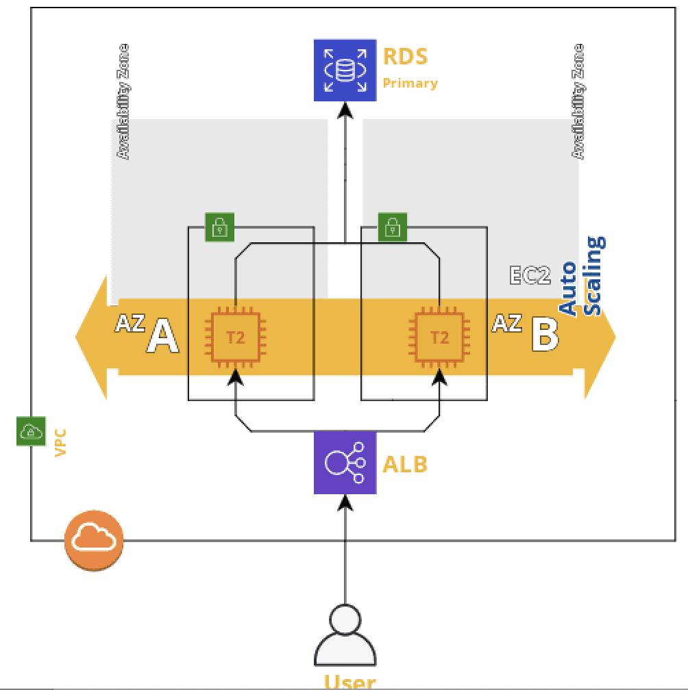

# WordPress on AWS

## Overview

This cloudformation stack will deploy a Highly available and scalable Wordpress site connected to an RDS MySQL database.

* The EC2 instances are placed on multiple availability zones to ensure High Availability.
* EC2 instances are placed inside an Auto Scaling Group to ensure horizontal scalability.
* The EC2 instances are placed in a VPC and secured using security groups that only allow traffic from the ALB.
* The EC2 instances are able to access internet via the Internet gateway that has been created in this VPC.
* The RDS database instance is secured by placing it in another security group that only allows traffic from the EC2 instance security group on port 3306.
* Multi AZ can be enabled on the RDS database using the configuration options provided in the deployment script in this repository.



## How do I deploy the stack

Run the `deploy_stack.sh` script to deploy your stack.

The script should ask you for some parameters you need to set to create/update the stack.
You can either provide inputs to that or go with the defaults by just pressing ENTER.
Please note that `DBUser` and `DBPassword` settings do not have any default and you will have to provide inputs for those.

```bash
$ ./deploy_stack.sh <aws_region> <stack_name> wordpress.yaml
```
After the script has run successfully you should get the wordpress website URL as an output.
## Assumptions

* `AWS_ACCESS_KEY_ID` and `AWS_SECRET_ACCESS_KEY` are already set as environment variables or it has been configured in `~/.aws/credentials` file.
* AWS CLI has been installed on the host that executes the `deploy_stack` script.